# User Flow Diagrams

## Rachel Lee Patient Advocacy

### 1. Consultation Booking Flow
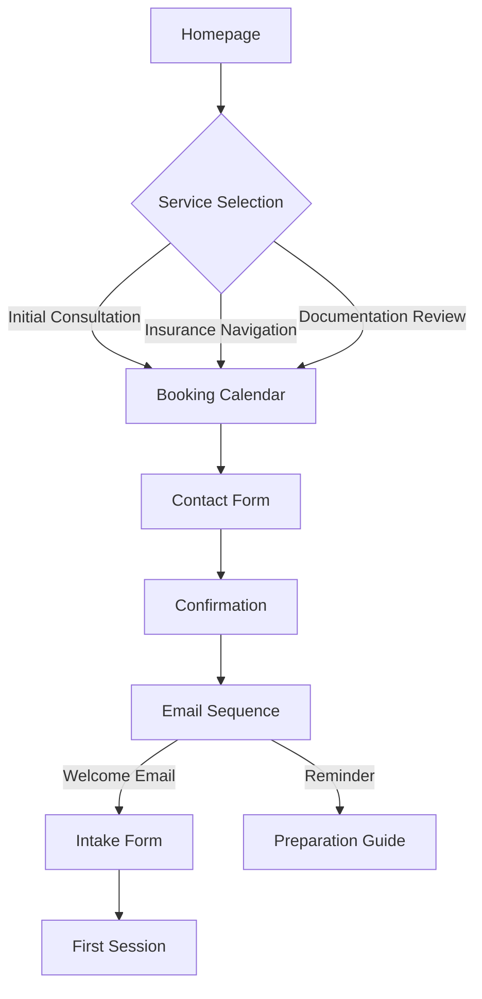

### 2. Resource Library Access Flow
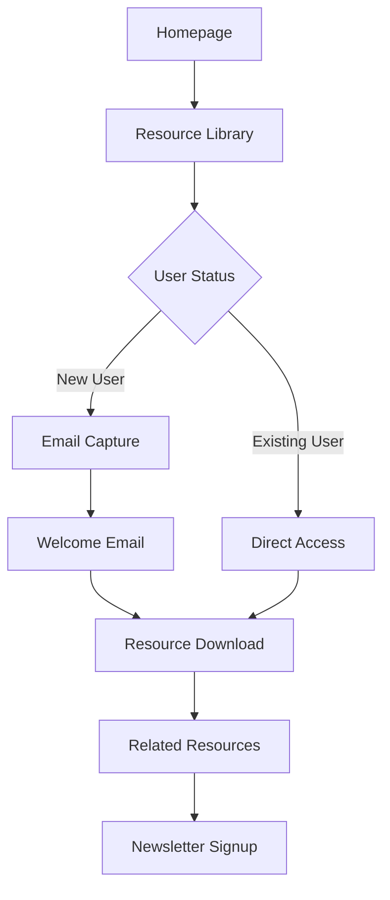

### 3. Community Engagement Flow
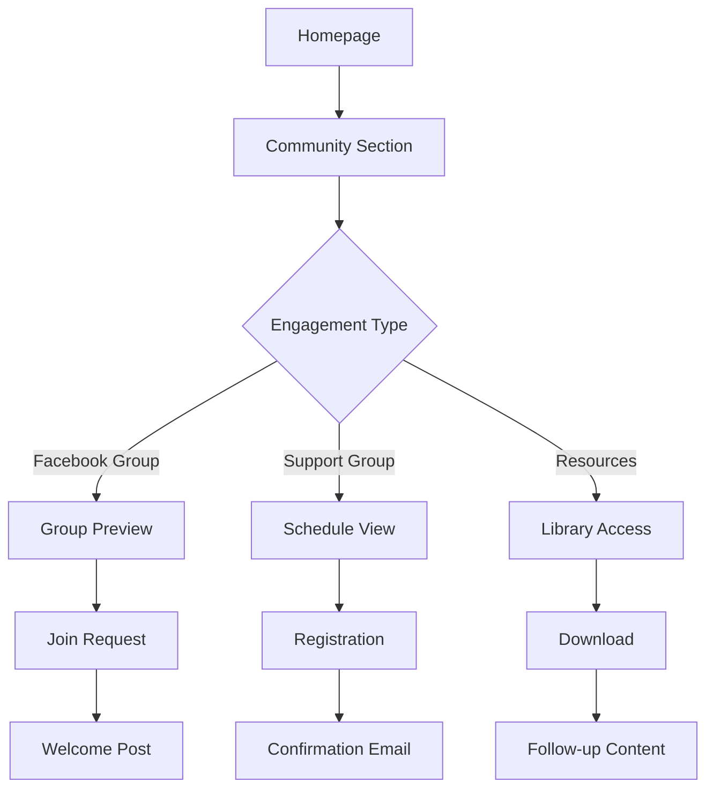

## UMI Lee

### 1. Movement Assessment Flow
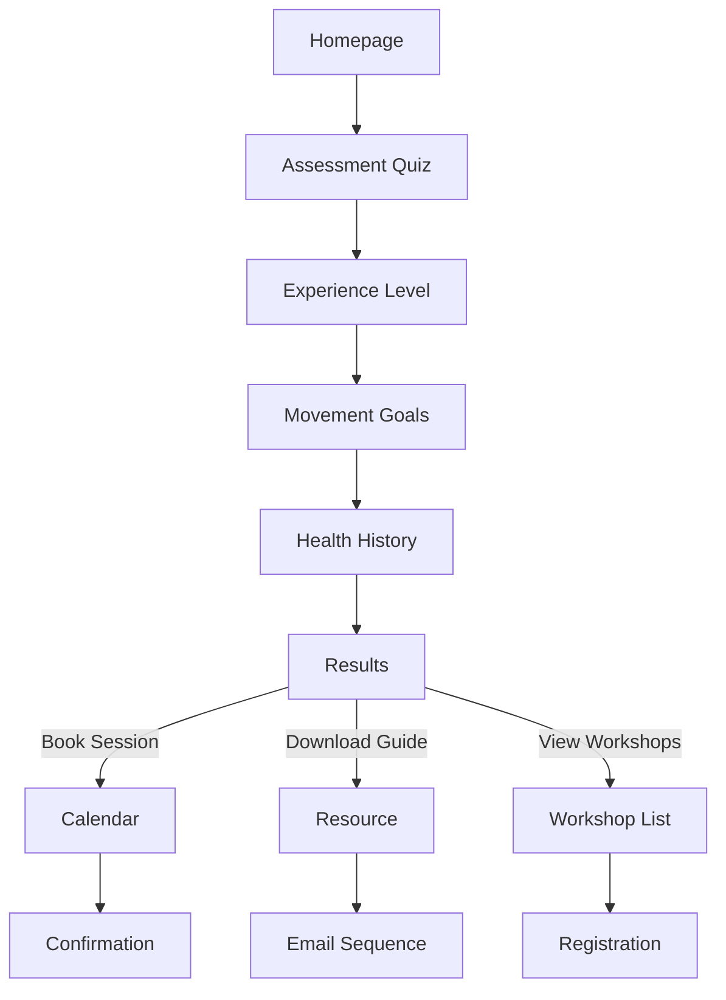

### 2. Workshop Registration Flow
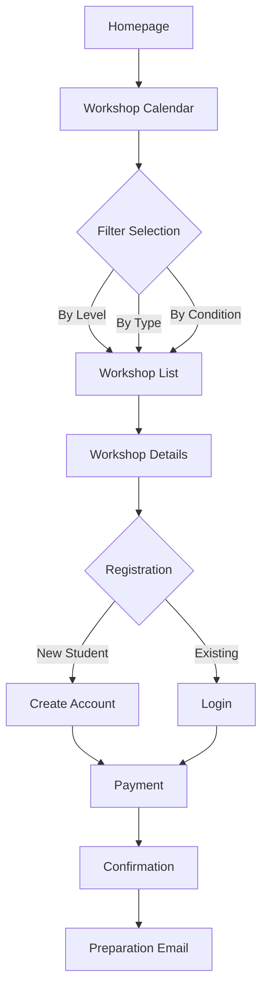

### 3. Progress Tracking Flow
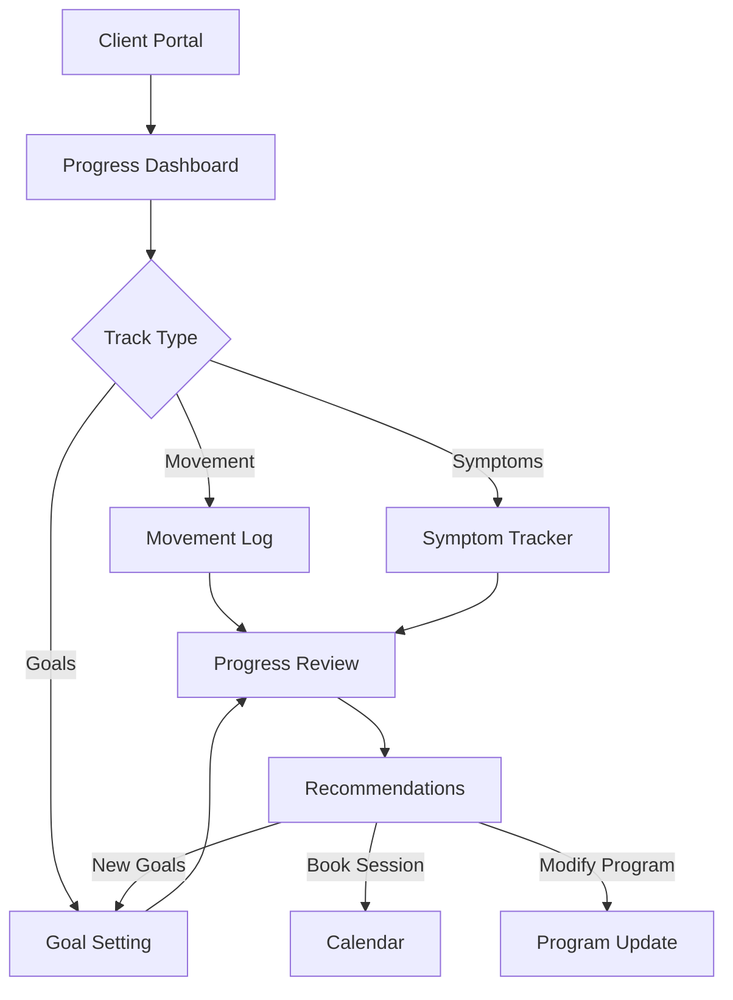

## Email Sequence Flows

### 1. Welcome Sequence
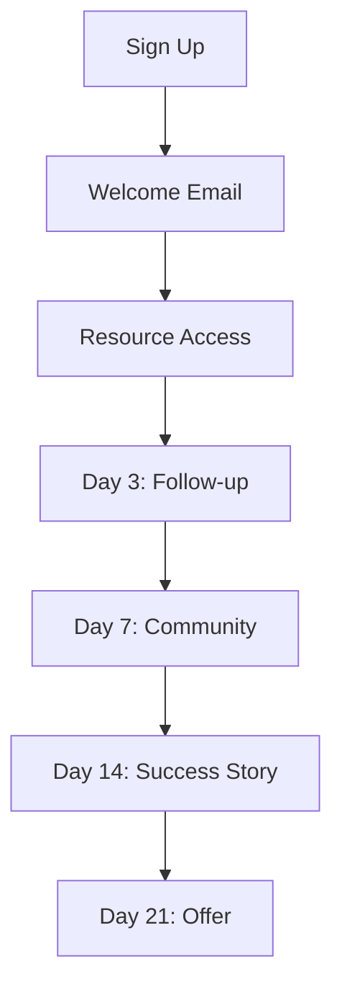

### 2. Workshop Nurture
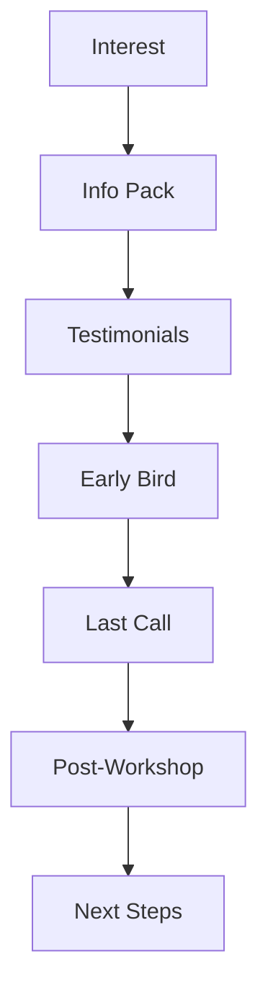

## Conversion Optimization Points

### Key Metrics Tracking
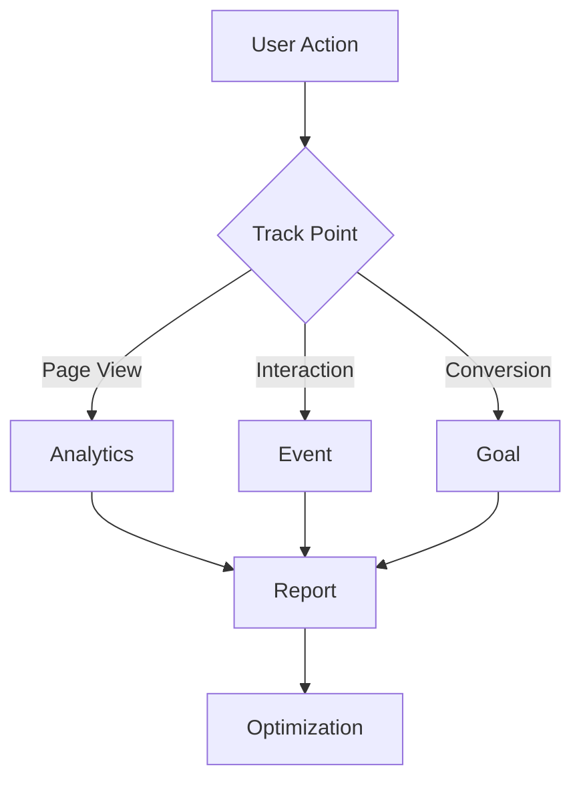

### Abandonment Recovery
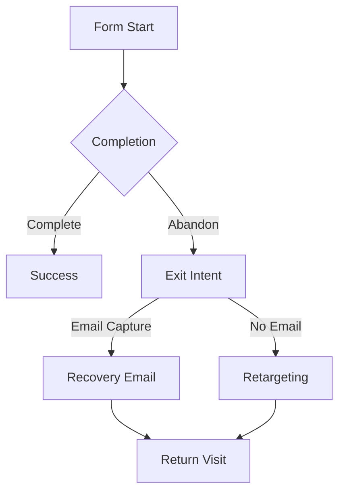

## Mobile User Flows

### Mobile-Specific Paths
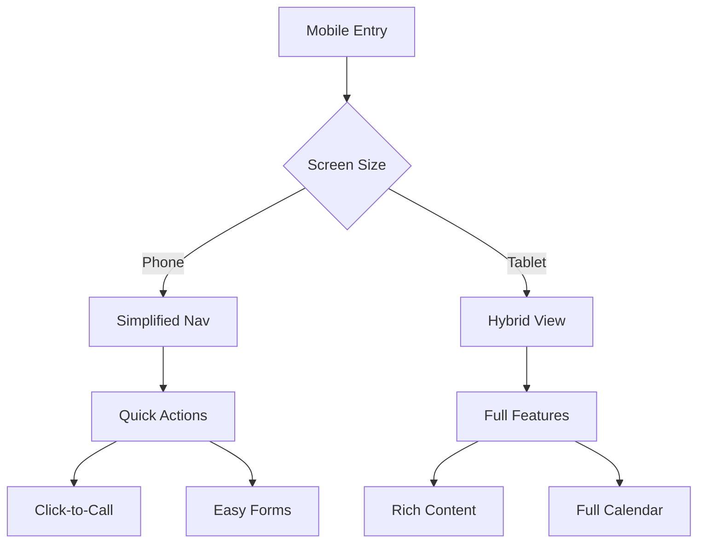

### Progressive Disclosure
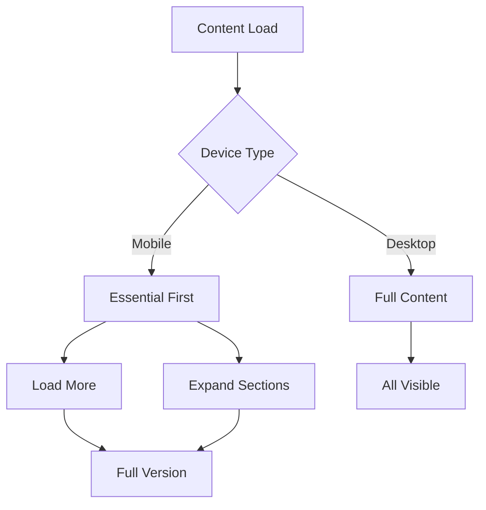