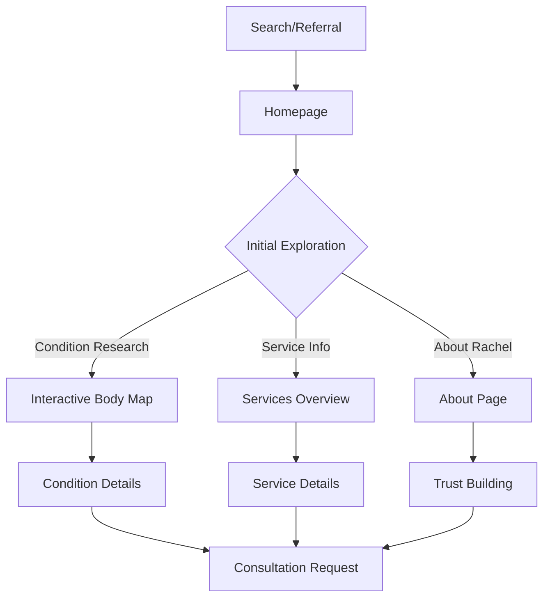
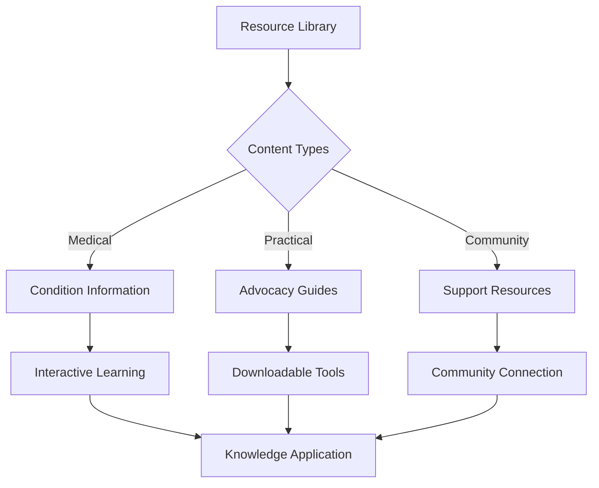
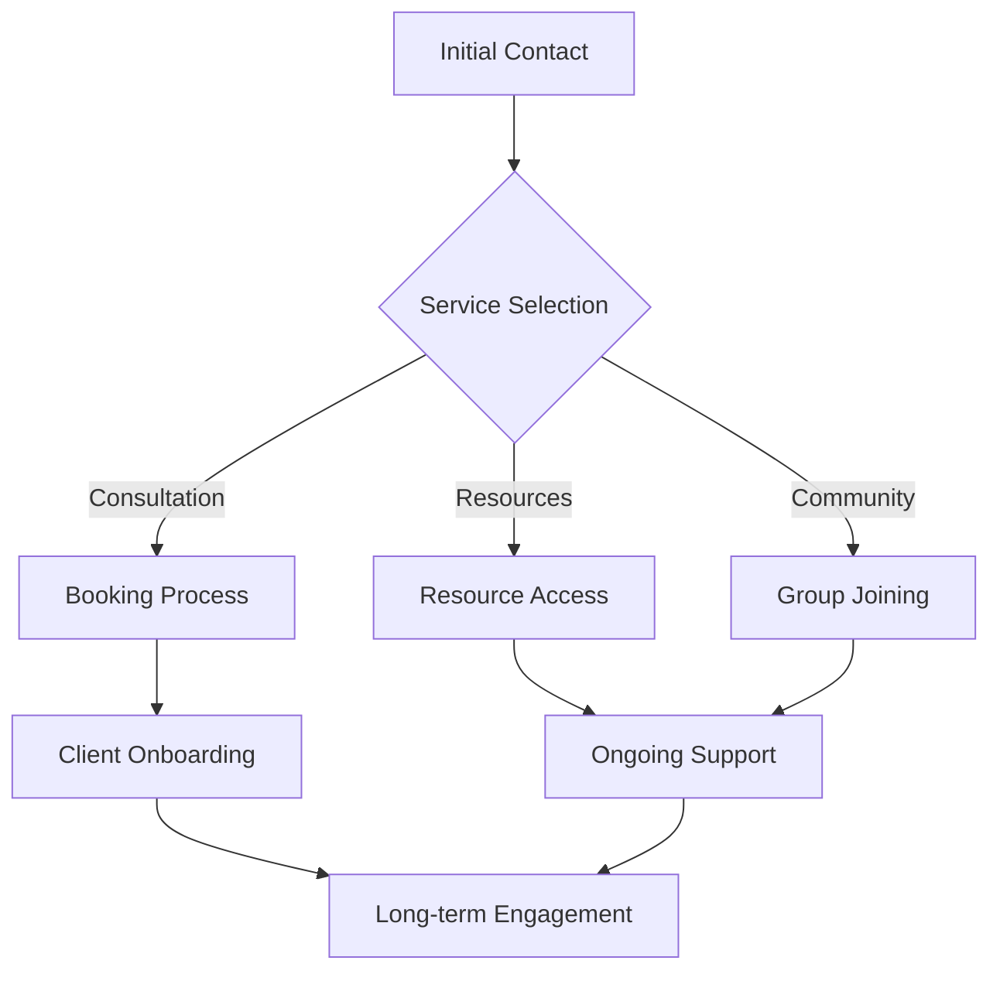

# Comprehensive User Journey Map - Rachel Lee Patient Advocacy

## Core User Personas

### 1. Newly Diagnosed Patient
- **Background**: Recently diagnosed with chronic condition
- **Goals**: Understanding condition, finding support, navigating healthcare
- **Pain Points**: Overwhelmed, uncertain about next steps, needs guidance
- **Key Needs**: Clear information, emotional support, practical assistance

### 2. Experienced Patient
- **Background**: Living with condition(s) for some time
- **Goals**: Better management, advocacy skills, community connection
- **Pain Points**: System frustration, coordination challenges
- **Key Needs**: Advanced resources, community support, efficient tools

### 3. Caregiver/Family Support
- **Background**: Supporting loved one with health challenges
- **Goals**: Learning advocacy skills, finding resources, balancing care
- **Pain Points**: Time management, emotional burden, knowledge gaps
- **Key Needs**: Practical tools, emotional support, educational resources

## Primary User Journeys

### 1. Discovery Journey (Awareness → Engagement)

#### Key Touchpoints
1. **Entry Points**
   - Google search (condition-specific)
   - Healthcare provider referrals
   - Social media presence
   - Community recommendations

2. **First Impression**
   - Clear value proposition
   - Professional credibility
   - Easy navigation
   - Immediate resource access

3. **Trust Building**
   - Client testimonials
   - Professional credentials
   - Educational content
   - Community presence

### 2. Education Journey (Learning → Understanding)

#### Educational Pathways
1. **Condition Understanding**
   - Interactive body map
   - Symptom guides
   - Treatment information
   - Research updates

2. **Advocacy Skills**
   - Self-advocacy guides
   - Healthcare navigation tips
   - Insurance information
   - Communication templates

3. **Support Resources**
   - Community forums
   - Support group access
   - Caregiver resources
   - Wellness tools

### 3. Engagement Journey (Connection → Action)

#### Engagement Points
1. **Initial Connection**
   - Consultation booking
   - Resource downloads
   - Newsletter signup
   - Community joining

2. **Ongoing Support**
   - Regular check-ins
   - Progress tracking
   - Resource updates
   - Community participation

3. **Long-term Value**
   - Advanced resources
   - Advocacy mastery
   - Community leadership
   - Success sharing

## User Flow Optimization

### 1. Navigation Priorities
- Clear pathways to key information
- Intuitive menu structure
- Consistent navigation patterns
- Mobile-friendly design

### 2. Content Strategy
- Progressive information disclosure
- Multi-format content delivery
- Regular content updates
- Personalized recommendations

### 3. Conversion Points
- Strategic CTA placement
- Clear value proposition
- Simple conversion process
- Follow-up automation

## Success Metrics

### 1. Engagement Metrics
- Time on site
- Pages per session
- Resource downloads
- Return visits

### 2. Conversion Metrics
- Consultation bookings
- Resource access
- Community joins
- Newsletter signups

### 3. Satisfaction Metrics
- Client feedback
- Testimonial generation
- Referral rates
- Community engagement

## Implementation Priorities

### Phase 1: Core Journey
- [ ] Homepage optimization
- [ ] Interactive body map
- [ ] Service clarity
- [ ] Basic resources

### Phase 2: Education Enhancement
- [ ] Resource library expansion
- [ ] Interactive learning tools
- [ ] Community features
- [ ] Progress tracking

### Phase 3: Advanced Features
- [ ] Personalization
- [ ] Advanced analytics
- [ ] Community expansion
- [ ] Integration optimization 