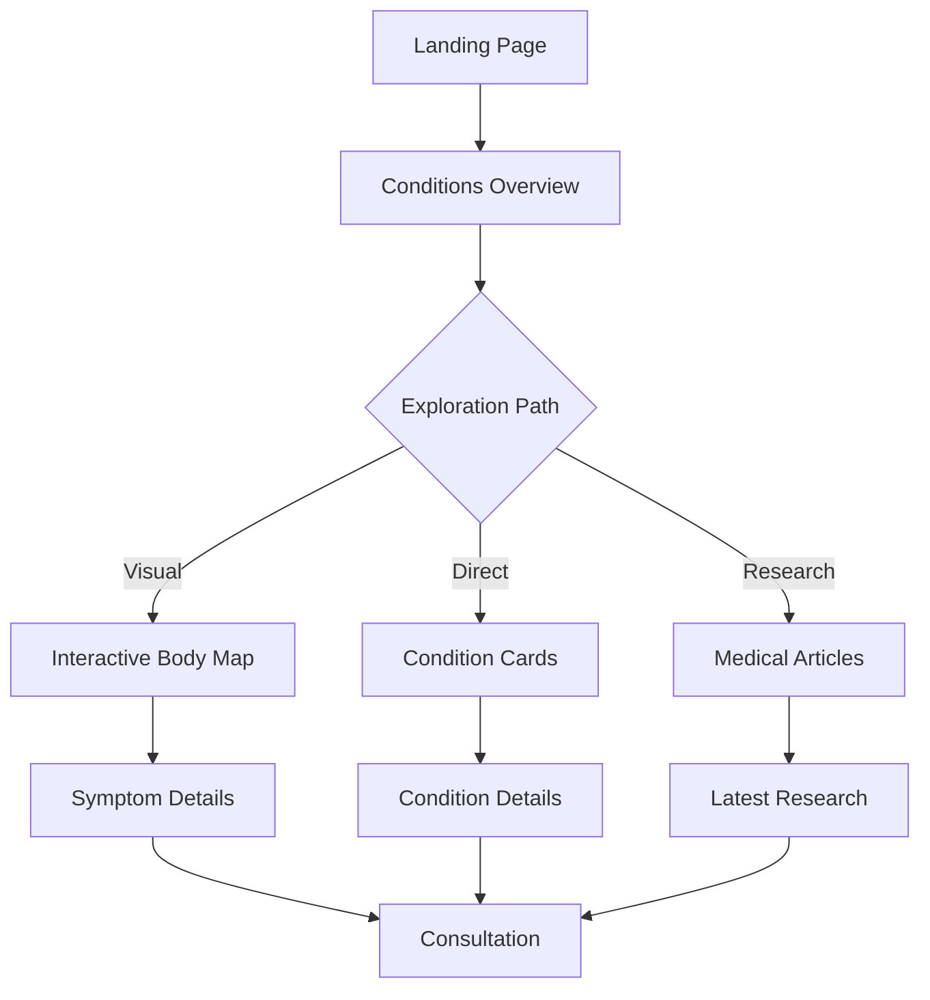
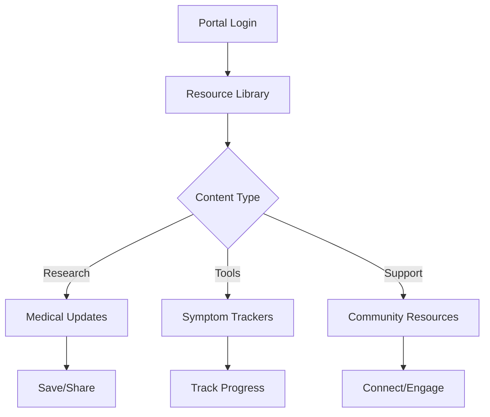

# Conditions Page User Journey & Implementation Plan

## Overview
The conditions page serves as an educational hub that combines interactive exploration, medical information, and clear pathways to support. This document outlines the user journeys and implementation details for the main branch.

## User Journeys

### 1. New Patient Journey


#### Key Touchpoints
1. Initial Landing
   - Clear value proposition
   - Easy navigation options
   - Visual engagement

2. Condition Discovery
   - Interactive body map
   - Symptom-based exploration
   - Clear condition categories

3. Information Gathering
   - Detailed condition information
   - Related symptoms
   - Treatment approaches

4. Support Access
   - Consultation booking
   - Resource downloads
   - Community connection

### 2. Existing Client/Caregiver Journey


## Page Structure

### 1. Interactive Body Map Section
- SVG-based interactive map
- Clickable body regions
- Dynamic symptom display
- Condition associations

### 2. Primary Conditions Grid
- EDS/HSD information
- POTS details
- MCAS overview
- Related conditions

### 3. Research & Updates
- Latest studies
- Treatment updates
- Community news
- Filtered content views

### 4. Resource Integration
- Symptom trackers
- Educational materials
- Support group access
- Consultation booking

## Technical Components

### 1. Interactive Components
```javascript
// Body Map Component Structure
class BodyMap {
    - Interactive SVG regions
    - Condition mappings
    - Symptom correlations
    - Dynamic information display
}

// Research Filter System
class ResearchFilter {
    - Content categorization
    - Dynamic filtering
    - Search functionality
    - Update management
}
```

### 2. Content Management
- Dynamic article loading
- Content categorization
- Search functionality
- Filter system

### 3. User Interaction Tracking
- Click patterns
- Content engagement
- Conversion points
- Journey mapping

## Implementation Phases

### Phase 1: Core Structure
1. Basic page layout
2. Navigation integration
3. Content organization
4. Mobile responsiveness

### Phase 2: Interactive Features
1. Body map implementation
2. Condition cards
3. Research filters
4. Resource links

### Phase 3: Content Integration
1. Medical information
2. Research articles
3. Resource library
4. Community features

### Phase 4: Enhancement
1. Animation refinement
2. Performance optimization
3. Accessibility improvements
4. Analytics integration

## Success Metrics

### User Engagement
- Time on page
- Interaction rate
- Content consumption
- Return visits

### Conversion Goals
- Consultation bookings
- Resource downloads
- Community joins
- Newsletter signups

## Content Strategy

### Medical Information
- Peer-reviewed sources
- Clear terminology
- Visual aids
- Regular updates

### Resource Organization
- Categorized content
- Progressive disclosure
- Clear hierarchy
- Easy navigation

## Design Guidelines

### Visual Hierarchy
- Clear headings
- Consistent styling
- Intuitive navigation
- Visual cues

### Interactive Elements
- Hover states
- Click feedback
- Loading states
- Error handling

### Accessibility
- Screen reader support
- Keyboard navigation
- Color contrast
- Clear focus states

## Next Steps for Main Branch Implementation

1. Create base HTML structure
   - Navigation integration
   - Content sections
   - Interactive elements

2. Implement styling
   - Responsive design
   - Animation system
   - Component styles

3. Add functionality
   - Body map interaction
   - Content filtering
   - Dynamic loading

4. Integrate content
   - Medical information
   - Research articles
   - Resource links

5. Testing & optimization
   - Performance testing
   - User testing
   - Analytics setup 